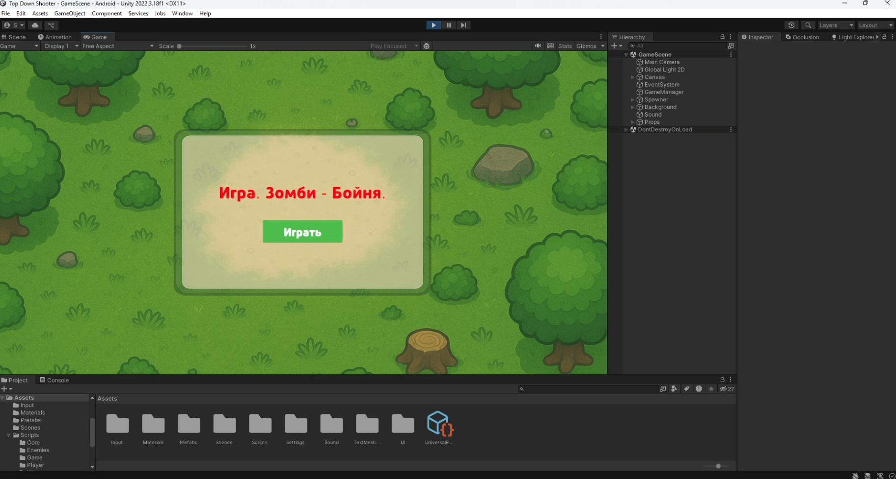
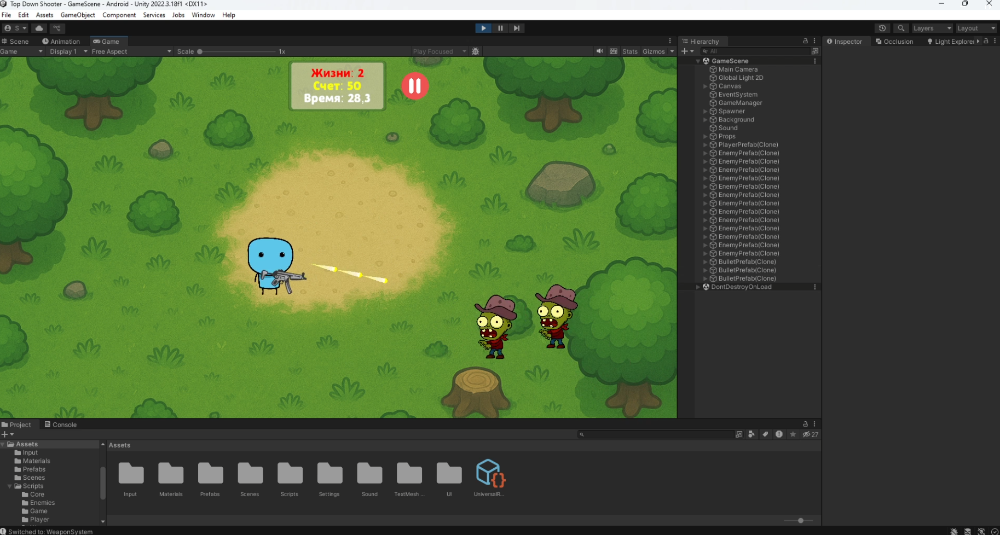
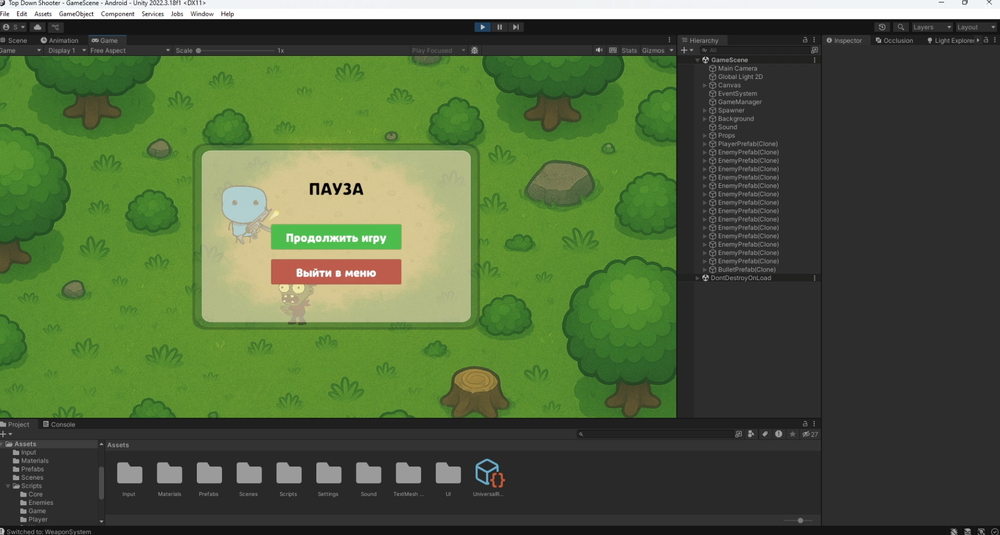
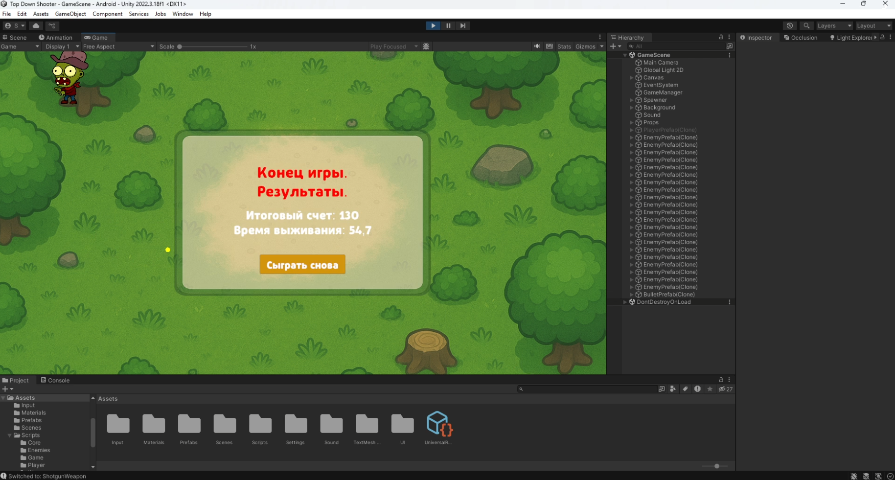

# Top-Down-Shooter-2D
Классическая 2D-игра-шутер (стрелялка) с видом сверху.
Unity 2022.3.18
Особенности:
Основной цикл игры: 
- Игрок управляет героем, героя можно контролировать стрелочками или кнопками WASD;
- У героя есть оружие из которого вылетают пули и при нажатии ЛКМ герой начинает стрелять в сторону указателя;
- Реализовано бы 2 вида оружия и свободное переключение между ними (через ПКМ);
- Враги хаотично появляются за экраном и бегут прямо к герою. Когда враги касаются героя у него отнимаются жизни;
- Аккумуляция очков за уничтоженных врагов;
- Добавлены визуальные эфекты пуль (VFX), звуковые эффекты (SFX);
- После того, как закончились жизни, игра заканчивается.

<table>
    <tr>
        <td>
            
        </td>
    </tr>
    <tr>
        <td>
            
        </td>
    </tr>
    <tr>
        <td>
            
        </td>
    <tr>
    <tr>
        <td>
            
        </td>
    <tr>
</table>
    
